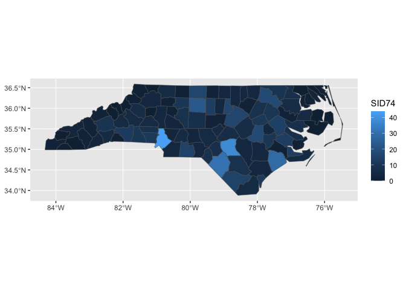
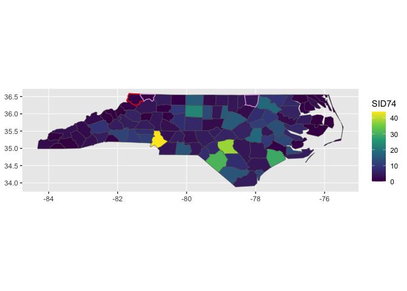
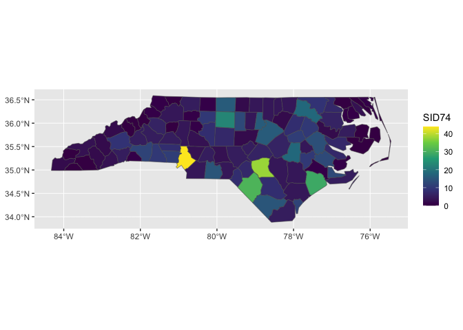
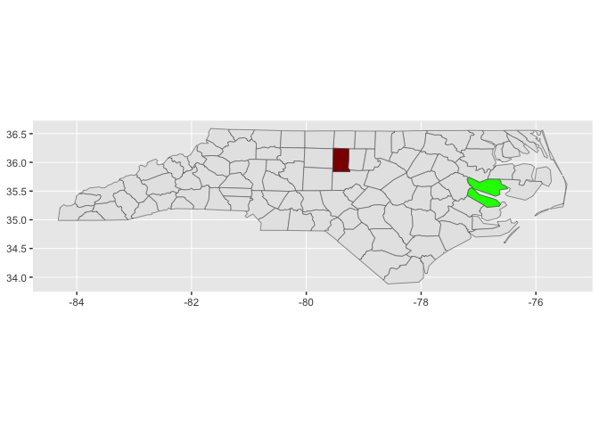
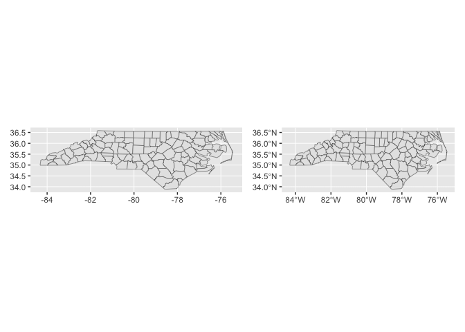
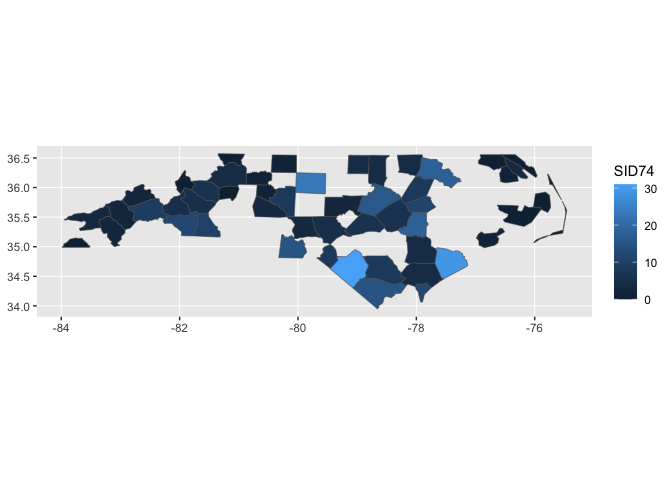
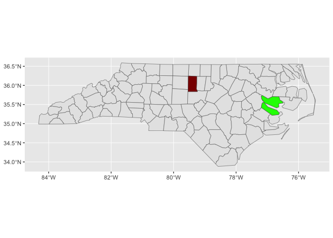
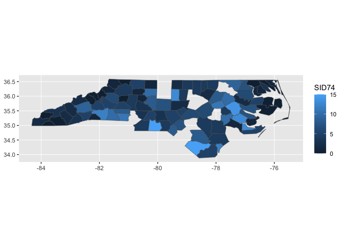
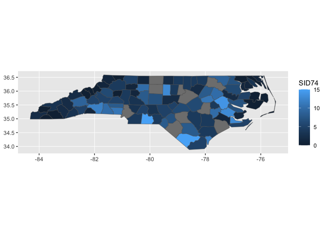

<!-- README.md is generated from README.Rmd. Please edit that file -->

# ggnc

<!-- badges: start -->

<!-- badges: end -->

The goal of ggnc is to …

## Installation

You can install the development version of ggnc from
[GitHub](https://github.com/) with:

``` r
# install.packages("devtools")
devtools::install_github("EvaMaeRey/ggnc")
```

## Example

This is a basic example which shows you how to solve a common problem:

``` r
library(tidyverse)
#> ── Attaching core tidyverse packages ──────────────────────── tidyverse 2.0.0 ──
#> ✔ dplyr     1.1.0     ✔ readr     2.1.4
#> ✔ forcats   1.0.0     ✔ stringr   1.5.0
#> ✔ ggplot2   3.4.1     ✔ tibble    3.2.0
#> ✔ lubridate 1.9.2     ✔ tidyr     1.3.0
#> ✔ purrr     1.0.1     
#> ── Conflicts ────────────────────────────────────────── tidyverse_conflicts() ──
#> ✖ dplyr::filter() masks stats::filter()
#> ✖ dplyr::lag()    masks stats::lag()
#> ℹ Use the conflicted package (<http://conflicted.r-lib.org/>) to force all conflicts to become errors
library(ggnc)
## basic example code
```

What is special about using `README.Rmd` instead of just `README.md`?
You can include R chunks like so:

``` r
nc %>% 
  ggplot() + 
  geom_sf() ->
classic_approach

classic_approach
```



``` r
library(tidyverse)
nc_flat %>%
  ggplot() +
  aes(fips = FIPS) +
  geom_sf_countync() ->
flat_file_friendly_approach

flat_file_friendly_approach
```


``` r

last_plot() + 
  aes(fill = SID74) +
  scale_fill_viridis_c()
```


``` r

last_plot() + 
  geom_sf_countync(county = "Ashe", color = "red", lwd = .5)
```


``` r


last_plot() + 
  geom_sf_countync(county = c("Alleghany", "Warren"), 
                   color = "plum", lwd = .5)
```



``` r
nc_flat %>% 
  select(FIPS, BIR74:NWBIR79) %>% 
  pivot_longer(-FIPS) %>% 
  group_by(name) %>%
  mutate(value_sds = (value - mean(value, na.rm = T))/sd(value, na.rm = T)) %>%
  mutate(rank = rank(value)) %>%
  ggplot() + 
  aes(fips = FIPS) +
  aes(fill = rank) + 
  geom_sf_countync() +
  facet_wrap(~name)
```



``` r

nc_flat %>% 
  ggplot() + 
  aes(fips = FIPS) + 
  geom_sf_countync() +
  ggnc:::geom_sf_nc_alamance(fill = "darkred") + 
  ggnc:::geom_sf_nc_beaufort(fill = "green")
```



## Not there yet

``` r
identical(flat_file_friendly_approach, classic_approach)
#> [1] FALSE
library(patchwork)
flat_file_friendly_approach + classic_approach
```



> Graticules Graticules are grid lines along equal longitude (meridians)
> or latitude (parallels) that, depending on the projection used, often
> plot as curved lines on a map, giving it reference in terms of
> longitude and latitude. The sf function st\_graticule tries to create
> a graticule grid for arbitrary maps. As there are infinitely many
> projections, there are most likely many cases where it does not
> succeed in doing this well, and examples of these are welcomed as sf
> issues.

> contains a geom specially for simple feature objects, with support for
> graticule white lines in the background using sf::st\_graticule.
> Support is currently good for polygons; for lines or points, your
> mileage may vary.

``` r
layer_data(classic_approach) %>% head()
#>                         geometry PANEL group      xmin      xmax     ymin
#> 1 MULTIPOLYGON (((-81.47276 3...     1    -1 -84.32385 -75.45698 33.88199
#> 2 MULTIPOLYGON (((-81.23989 3...     1    -1 -84.32385 -75.45698 33.88199
#> 3 MULTIPOLYGON (((-80.45634 3...     1    -1 -84.32385 -75.45698 33.88199
#> 4 MULTIPOLYGON (((-76.00897 3...     1    -1 -84.32385 -75.45698 33.88199
#> 5 MULTIPOLYGON (((-77.21767 3...     1    -1 -84.32385 -75.45698 33.88199
#> 6 MULTIPOLYGON (((-76.74506 3...     1    -1 -84.32385 -75.45698 33.88199
#>       ymax linetype alpha stroke
#> 1 36.58965        1    NA    0.5
#> 2 36.58965        1    NA    0.5
#> 3 36.58965        1    NA    0.5
#> 4 36.58965        1    NA    0.5
#> 5 36.58965        1    NA    0.5
#> 6 36.58965        1    NA    0.5
layer_data(flat_file_friendly_approach) %>% head()
#>                         geometry PANEL group      xmin      xmax     ymin
#> 1 MULTIPOLYGON (((-81.47276 3...     1    -1 -81.74107 -81.23989 36.23436
#> 2 MULTIPOLYGON (((-81.23989 3...     1    -1 -81.34754 -80.90344 36.36536
#> 3 MULTIPOLYGON (((-80.45634 3...     1    -1 -80.96577 -80.43531 36.23388
#> 4 MULTIPOLYGON (((-76.00897 3...     1    -1 -76.33025 -75.77316 36.07282
#> 5 MULTIPOLYGON (((-77.21767 3...     1    -1 -77.90121 -77.07531 36.16277
#> 6 MULTIPOLYGON (((-76.74506 3...     1    -1 -77.21767 -76.70750 36.23024
#>       ymax linetype alpha stroke
#> 1 36.58965        1    NA    0.5
#> 2 36.57286        1    NA    0.5
#> 3 36.56521        1    NA    0.5
#> 4 36.55716        1    NA    0.5
#> 5 36.55629        1    NA    0.5
#> 6 36.55629        1    NA    0.5

layer_scales(classic_approach) %>% head()
#> $x
#> <ScaleContinuousPosition>
#>  Range:  -84.3 -- -75.5
#>  Limits: -84.3 -- -75.5
#> 
#> $y
#> <ScaleContinuousPosition>
#>  Range:  33.9 -- 36.6
#>  Limits: 33.9 -- 36.6
layer_scales(flat_file_friendly_approach) %>% head()
#> $x
#> <ScaleContinuousPosition>
#>  Range:  -84.3 -- -75.5
#>  Limits: -84.3 -- -75.5
#> 
#> $y
#> <ScaleContinuousPosition>
#>  Range:  33.9 -- 36.6
#>  Limits: 33.9 -- 36.6

layer_grob(classic_approach)[[1]]
#> pathgrob[GRID.pathgrob.627]
layer_grob(flat_file_friendly_approach)[[1]]
#> pathgrob[GRID.pathgrob.628]
```

## might be nice to keep all of the reference geometries

Haven’t been able to do that, throwing error. The result with partial
data to be displayed.

``` r
nc_flat %>% 
  slice_sample(n = 50, replace = F) %>% 
  ggplot() + 
  aes(fips =FIPS) +
  geom_sf_countync() + 
  aes(fill = SID74)
```



``` r

nc %>% 
  mutate(SID74 = ifelse(SID74>15, NA, SID74)) %>% 
  ggplot() + 
  geom_sf() +
  aes(fill = SID74)
```



``` r


nc_flat %>% 
  filter(SID74 <= 15) %>% 
  ggplot() + 
  aes(fips =FIPS) +
  geom_sf_countync() + 
  aes(fill = SID74)
```



``` r

nc_flat %>% 
  mutate(SID74 = ifelse(SID74 > 15, NA, SID74)) %>% 
  ggplot() + 
  aes(fips =FIPS) +
  geom_sf_countync() + 
  aes(fill = SID74)
```



# this right join attempt throws an error. Not sure how to address

``` r
compute_county_nc <- function(data, scales, county = NULL){

  reference_filtered <- reference_full
  #
  if(!is.null(county)){

    county %>% tolower() -> county

    reference_filtered %>%
      dplyr::filter(.data$county_name %>%
                      tolower() %in%
                      county) ->
      reference_filtered

  }

  # to prevent overjoining
  reference_filtered %>%
    dplyr::select("fips", "geometry", "xmin",
                  "xmax", "ymin", "ymax") ->
    reference_filtered


  data %>%
    dplyr::right_join(reference_filtered, by = join_by(fips)) %>%
    dplyr::mutate(group = -1) %>%
    dplyr::select(-fips)

}


StatCountync <- ggplot2::ggproto(`_class` = "StatCountync",
                               `_inherit` = ggplot2::Stat,
                               compute_panel = compute_county_nc,
                               default_aes = ggplot2::aes(geometry =
                                                            ggplot2::after_stat(geometry)))

geom_sf_countync <- function(
                                 mapping = NULL,
                                 data = NULL,
                                 position = "identity",
                                 na.rm = FALSE,
                                 show.legend = NA,
                                 inherit.aes = TRUE, ...
                                 ) {

                                 c(ggplot2::layer_sf(
                                   stat = StatCountync,  # proto object from step 2
                                   geom = ggplot2::GeomSf,  # inherit other behavior
                                   data = data,
                                   mapping = mapping,
                                   position = position,
                                   show.legend = show.legend,
                                   inherit.aes = inherit.aes,
                                   params = rlang::list2(na.rm = na.rm, ...)),
                                   coord_sf(default = TRUE)
                                 )

                 }

nc_flat %>% 
  filter(SID74 <= 15) %>% 
  ggplot() + 
  aes(fips =FIPS) +
  geom_sf_countync() + 
  aes(fill = SID74)
#> Error in `scale_apply()`:
#> ! `scale_id` must not contain any "NA"
```

    Backtrace:
     1. base (local) `<fn>`(x)
     2. ggplot2:::print.ggplot(x)
     4. ggplot2:::ggplot_build.ggplot(x)
     5. layout$train_position(data, scale_x(), scale_y())
     6. ggplot2 (local) train_position(..., self = self)
     7. self$facet$train_scales(...)
     8. ggplot2 (local) train_scales(...)
     9. ggplot2:::scale_apply(layer_data, x_vars, "train", SCALE_X, x_scales)
